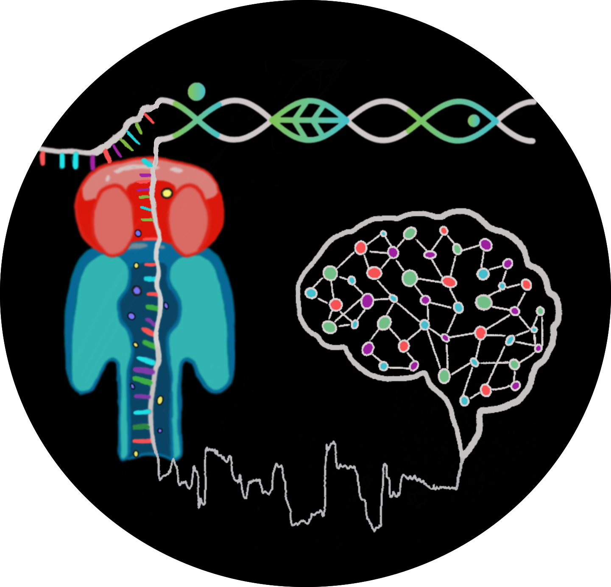
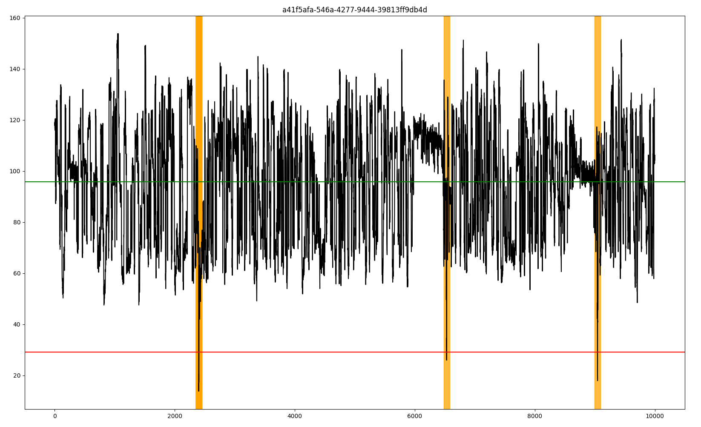

# Nanopore- and AI-empowered metagenomic viability inference

In this study, we developed ResNet models (models/antibiotic_ecoli_ResNet_550ep.ckpt and models/UV_ecoli_ResNet_677ep.ckpt) model to differentiate nanopore signals (squiggles) coming from living and dead microorganisms. 
Link to preprint: https://www.biorxiv.org/content/10.1101/2024.06.10.598221v2

 

## Squiggle4Viability

This repository contains scripts used in the paper for processing POD5 files, generating ground truth labels, filtering POD5 files based on ground truth, preprocessing data, concatenating preprocessed files, training models (ResNet and Transformer), running inference, generating Class Activation Maps (CAMs), detecting sudden drops in signals, generating concatenated tensors from one-hot encoded layers, and conducting metagenomics analysis.

## Table of Contents

- [Installation](#installation)
- [Neural Networks Trainings, Predictions, Explainability and Algorithm for Anomaly Detection](#neural-networks-trainings-predictions-and-algorithm-for-anomaly-detection)
  - [Segment Signals](#segment-signals)
  - [Generate Ground Truth Labels](#generate-ground-truth-labels)
  - [Create Training, Validation, Test Set](#create-training-validation-test-set)
  - [Pre-processing for POD5](#pre-processing-for-pod5)
  - [Concatenate Preprocessed Files](#concatenate-preprocessed-files)
  - [Training](#training)
  - [Inference on Fixed Length of Chunks](#inference-on-fixed-length-of-chunks)
  - [Inference on Full-Length Variable Signals (No Chunking Required)](#inference-on-full-length-variable-signals-no-chunking-required)
  - [Model Performance Analysis](#model-performance-analysis)
  - [Generate Class Activation Maps (CAMs)](#generate-class-activation-maps-cams)
  - [Analyze Impact of Dark CAM Regions by Masking Consecutively](#analyze-impact-of-dark-cam-regions-by-masking-consecutively)
  - [Plot Probabilities in Masking Steps](#plot-probabilities-in-masking-steps)
  - [XAI Rule](#xai-rule)
  - [Generate Concatenated Tensor from One-Hot-Encoding Layers](#generate-concatenated-tensor-from-one-hot-encoding-layers)
- [Metagenomics Analysis](#metagenomics-analysis)
  - [Dorado Basecalling and Demultiplexing](#dorado-basecalling-and-demultiplexing)
  - [Extract Read IDs without 'pi' Tag from BAM (non-chimera detection)](#extract-read-ids-without-pi-tag-from-bam-non-chimera-detection)
  - [Read Processing](#read-processing)
  - [Assembly and Polishing](#assembly-and-polishing)
  - [Kraken2 Contig Classification](#kraken2-contig-classification)
  - [Kraken2 Read Classification](#kraken2-read-classification)
  - [Extract Read IDs by Genus from Kraken2 Output](#extract-read-ids-by-genus-from-kraken2-output)


## Installation

To set up the project, follow these steps:

1. **Clone the repository:**

   ```
   git clone https://github.com/Genomics4OneHealth/Squiggle4Viability.git
   cd Squiggle4Viability
   ```

2. **Install the required dependencies:**

   You can install the necessary dependencies using the `requirements.txt` file:

   ```
   pip install -r requirements.txt
   ```


## Neural Networks Trainings, Predictions, and Algorithm for Anomaly Detection

### Segment Signals
The script reads POD5 files from the specified directory, filters the data based on the given threshold, processes the data into chunks, and saves the results into the specified output directory.


```
python AI_scripts/segment.py --path_dir /path/to/input_pod5_files --out_dir /path/to/output_directory --chunk_size 10000 --start_index 1500
```

```
--path_dir PATH: The directory containing the input POD5 files. This argument is required.
--out_dir PATH: The directory where the filtered and processed POD5 files will be saved. This argument is required.
--chunk_size INTEGER: The chunk size for processing reads. The default is 10000. Optional.
--start_index INTEGER: The start index for processing reads. The default is 1500. Optional.
```


### Generate Ground Truth Labels

The script reads POD5 files from specified directories, processes the data, and creates balanced datasets for alive and dead signals. The datasets are then saved into specified output files.

```
python AI_scripts/create_groundtruth.py --alive_dir /path/to/alive_pod5_files --dead_dir /path/to/dead_pod5_files --output_dir /path/to/output_directory
```

```
--alive_dir PATH: The segmented, alive POD5 directory path (chunked version).
--dead_dir PATH: The segmented, dead POD5 directory path (chunked version). 
--output_dir PATH: Ground truth label path.

```


### Create Training, Validation, Test Set
The script reads POD5 files from a specified directory, filters the data based on the read IDs provided in a ground truth file, and outputs the filtered POD5 files to a specified directory.

```
python AI_scripts/filter_pod5_by_ground_truth.py --directory_path /path/to/input_pod5_files --filtered_dir_path /path/to/output_directory --text_file /path/to/read_ids.txt
```

```
--directory_path PATH: The directory containing the input POD5 files. This argument is required.
--filtered_dir_path PATH: The directory where the filtered POD5 files will be saved. This argument is required.
--text_file PATH: The ground truth file containing the list of read IDs to filter. This argument is required.
```


### Pre-processing for POD5

The script reads POD5 files from a specified directory, normalizes the data, and saves the results as PyTorch tensors in a specified output directory. It supports processing both positive (target) and negative (non-target) data.

```
python AI_scripts/preprocess.py -i /path/to/input_pod5_files -o /path/to/output_directory -dt pos -b 1000 -sl 10000
```

```
-i, --inpath PATH: The input POD5 directory path. This argument is required.
-o, --outpath PATH: The output directory path for saving PyTorch tensors. This argument is required.
-dt, --datatype TEXT: The class type: pos (positive/target) or neg (negative/non-target). This argument is required.
-b, --batch INTEGER: The batch size for processing reads. The default is 1000. Optional.
-sl, --sig_len INTEGER: The signal length for processing reads. The default is 10000. Optional.
```

### Concatenate preprocessed files

The script reads preprocessed positive and negative tensor files from specified directories, concatenates the tensors, and saves the resulting tensors to specified paths.

```
python AI_scripts/concat.py --preprocessed_pos_folder /path/to/preprocessed_pos --preprocessed_neg_folder /path/to/preprocessed_neg --save_pos /path/to/save_pos_tensor.pt --save_neg /path/to/save_neg_tensor.pt
```

```
--preprocessed_pos_folder PATH: The path to the folder containing preprocessed positive tensor files. This argument is required.
--preprocessed_neg_folder PATH: The path to the folder containing preprocessed negative tensor files. This argument is required.
--save_pos PATH: The path to save the concatenated positive tensor. This argument is required.
--save_neg PATH: The path to save the concatenated negative tensor. This argument is required.
```

### Training

The script reads preprocessed positive (target) and negative (non-target) tensor files from specified directories, trains the selected model, and saves the trained model checkpoints to a specified output directory. The script supports training using ResNet and Transformer models.

```
python AI_scripts/trainer.py -tt concat_tensor/train_pos.pt -nt concat_tensor/train_neg.pt -tv concat_tensor/val_pos.pt -nv concat_tensor/val_neg.pt -o trained_model/trainedmodel1.ckpt --batch 1000 -e 100 -m ResNet1 -sl 10000 -l 1e-4
```

```
-tt, --tTrain PATH: The path to the target sequence training set. This argument is required.
-tv, --tVal PATH: The path to the target sequence validation set. This argument is required.
-nt, --nTrain PATH: The path to the non-target sequence training set. This argument is required.
-nv, --nVal PATH: The path to the non-target sequence validation set. This argument is required.
-o, --outpath PATH: The directory path to save the trained model checkpoints. This argument is required.
-b, --batch INTEGER: The batch size for training. The default value is 1000. Optional.
-i, --interm PATH: The path and name for the model checkpoint to resume training (optional).
-m, --model_type TEXT: The model type for training. Options are "ResNet1", "ResNet2", "ResNet3", "Transformer", or "ResNet4Sequence". The default value is "ResNet1".
-sl, --sig_len INTEGER: The signal length. The default value is 10000. Optional.
-e, --epoch INTEGER: The number of epochs for training. The default value is 100. Optional.
-l, --learningrate FLOAT: The learning rate for training. The default value is 1e-4. Optional.
-nl, --num_letter INTEGER: The number of letters (A, C, G, T). The default value is 4. Optional.
```


### Inference on Fixed Length of Chunks

The script reads segmented signals in POD5 files from a specified directory, processes the data, and makes predictions using a pretrained model. The results are saved as text files in a specified output directory. This script is not applicable for variable signal length.


```
python AI_scripts/inference.py -m path_to_model_weights -i path_to_pod5_folder -o path_to_output_folder -mt model_type -sl signal_length
```

```
-m, --model PATH: The path to the pretrained model. This argument is required.
-i, --inpath PATH: The path to the folder containing the input POD5 files. This argument is required.
-o, --outpath PATH: The path to the output folder where results will be saved. This argument is required.
-mt, --model_type TEXT: The model architecture to use for inference. Options are "ResNet1", "ResNet2", "ResNet3", "Transformer", or "ResNet4Sequence". The default value is "ResNet1". This argument is required.
-sl, --sig_len INTEGER: The chunk size of the signal. The default value is 10000. Optional.
```

### Inference on Full-Length Variable Signals (No Chunking Required)
The AI_scripts/inference_variable_length.py script enables prediction directly on full-length signals from .pod5 files without requiring chunking. It handles variable signal lengths by grouping reads by length and batching them efficiently.
```
python AI_scripts/inference_variable_length.py \
    --model path_to_model_weights \
    --inpath path_to_pod5_folder \
    --outpath path_to_output_folder \
    --model_type ResNet1
```

```
--model, -m PATH         Path to the pretrained model weights.
--inpath, -i PATH        Input directory containing .pod5 files.
--outpath, -o PATH       Output directory for saving predictions.
--model_type, -mt TEXT   Model architecture to use. Options: "ResNet1", "ResNet2", "ResNet3", "Transformer", or "ResNet4Sequence".
```


### Model Performance Analysis

The `AI_scripts/evaluation.ipynb` notebook and `AI_scripts/evaluation_functions.py` script assess the model's performance by calculating metrics (accuracy, F1, specificity, recall, precision, AUPR, AUROC) and plotting performance curves (precision-recall and receiver operating characteristic curves).

### Generate Class Activation Maps (CAMs)

The script reads segmented POD5 files from a specified directory, processes the data, and generates CAMs using a pretrained model. The results are saved as PDF files in a specified output directory.
```
python AI_scripts/generate_cam.py \
    --ground_truth_file path/to/groundtruth.txt \
    --model_weights models/UV_ecoli_ResNet_677ep.ckpt \
    --cam_folder path/to/save/cams \
    --pod5_path path/to/pod5_file.pod5
```

```
--ground_truth_file PATH: The path to the ground truth file. This argument is required.
--model_weights PATH: The path to the pretrained model. This argument is required.
--cam_folder PATH: The path to the output folder where CAMs will be saved. This argument is required.
--pod5_path PATH: The path to the specific POD5 file. This argument is required.
```

### Analyze Impact of Dark CAM Regions by Masking Consecutively

The mask_dark_regions_cam.py script is designed to generate and plot Class Activation Maps (CAMs) for given POD5 files. It processes the raw data, computes the CAMs using a pretrained model, and generates visualizations of the CAMs along with the corresponding signal. Additionally, it consecutively masks dark regions in the CAMs to evaluate the impact of these regions on the model's predictions by calculating probabilities in each masking iteration and saving these values.

```
python mask_dark_regions_cam.py --ground_truth_file /path/to/ground_truth_file --data_folder /path/to/pod5_folder --model_weights /models/UV_ecoli_ResNet_677ep.ckpt --cams_folder_name CAMs --mask 200 --thr 0.8 --prob_thr 0.99 --batch_size 512 --nbr_dark_region 1 --regions True
```

```
--ground_truth_file PATH: The path to the ground truth file. This argument is required.
--data_folder PATH: The path to the folder containing the input POD5 files. This argument is required.
--model_weights PATH: The path to the pretrained model weights. This argument is required.
--cams_folder_name TEXT: The name of the folder to save the CAMs. Default is "CAMs".
--mask INTEGER: The length of the sequence to be masked. Default is 200.
--thr TEXT: The CAM threshold, choose between "maxi", "mini" or a number between 0.0 and 1.0. Default is 0.8.
--prob_thr TEXT: The probability threshold for selecting signal chunks. Default is 0.99.
--plot BOOLEAN: Whether to plot the CAMs or not. Default is False.
--batch_size INTEGER: The batch size for processing data. Default is 512.
--nbr_dark_region INTEGER: The number of dark regions in the CAM to consider. Default is 1.
--regions BOOLEAN: Whether to use regions for masking or not. Default is True.
```


### Plot Probabilities in Masking Steps

The plot_masking_steps.py script is designed to visualize the effect of masking different numbers of values on model prediction probabilities. This script reads the saved probabilities from previous masking steps (generated by mask_dark_regions_cam.py), calculates the mean and standard deviation for each masking step, and plots the results with 95% confidence intervals.

```
python plot_masking_steps.py --files ["masked_2000_values", "masked_1000_values", "masked_400_values", "masked_200_values", "masked_100_values"] --values ['2000', '1000', '400', '200', "100"] --title 'distribution_plots_all_p50.png'
```

```
--files (list): A list of folder names where the probabilities for different masking values are stored. Default is ["masked_2000_values", "masked_1000_values", "masked_400_values", "masked_200_values", "masked_100_values"].
--values (list): A list of masked values used as labels for the plot. Default is ['2000', '1000', '400', '200', "100"].
--title (str): The title of the plot. Default is 'distribution_plots_all_p50.png'.
```

### XAI Rule

The script reads POD5 files from a specified directory, normalizes the signals, detects sudden drops (one of the features observed via XAI) or anomalies, and saves the results to a specified output TSV file. Additionally, it generates visualizations of the detected points and saves them as PDF files.

```
python AI_scripts/detect_drops.py --out_path /out/file.tsv --in_path pod5_folder --figure_path figure/directory
```

```
--out_path PATH: The path for the output TSV file. This argument is required.
--in_path PATH: The path to the folder containing .pod5 files to be analyzed. This argument is required.
--figure_path PATH: The path to the directory where the figures will be saved. This argument is required.
--padding INTEGER: Padding around detected drops for visualization. The default value is 50. Optional.
```



### Generate Concatenated Tensor from One-Hot-Encoding Layers

The script reads sequences from a TSV file, one-hot encodes the sequences, and saves the concatenated one-hot encoded tensors to a specified output file.

```
python AI_scripts/onehotencoding.py --infile_path sequence.tsv --output_file concatenated_one-hot-encoding.pt --bases ACGT
```

```
--infile_path PATH: Path to the input TSV file (first column: read_id, second column: sequence). This argument is required.
--output_file PATH: File to save the concatenated one-hot encoded tensor. This argument is required.
--bases STRING: String of bases for one-hot encoding (e.g., "ACGT" or "ACGTM"). This argument is required.
```

## Metagenomics Analysis

### Dorado Basecalling and Demultiplexing
The script runs Dorado basecaller to convert raw nanopore signal data to nucleotide sequences and demultiplexes reads based on barcodes. The results are saved in the basecalled directory.

```
bash metagenomics_analysis/dorado_basecalling.sh
```
### Extract Read IDs without 'pi' Tag from BAM (non-chimera detection)

This script extracts read IDs from a BAM file that **do not** contain the `pi` tag — potentially indicating **non-chimeric reads**. It requires a BAM file aligned with tag annotations.

```
python metagenomics_analysis/extract_non_chimeras.py -b path/to/input.bam -o path/to/output.txt
```

```
-b, --bam PATH Path to the input BAM file.
-o, --output PATH Path to save the list of read IDs without 'pi' tags.
```

### Read Processing
This script processes barcode files using Porechop to remove adapter sequences and NanoFilt to filter reads longer than 100 bp. The results are saved in the porechop and nanofilt directories.

```
bash metagenomics_analysis/readprocessing.sh
```

### Assembly and Polishing
This script processes filtered reads using Flye, Minimap2, Samtools, and Racon to assemble and polish sequences. The results are stored in respective directories.

```
bash metagenomics_analysis/assembly_polishing.sh
```

### Kraken2 Contig Classification
The script uses Kraken2 to classify polished assemblies, generating taxonomic reports and classification outputs. The results are saved in the kraken2_contigs directory.

```
bash metagenomics_analysis/kraken2_contig_classification.sh
```

### Kraken2 Read Classification
The script uses Kraken2 to classify reads from Porechop outputs. The results are saved in the kraken2_reads directory.

```
bash metagenomics_analysis/kraken2_read_classification.sh
```

### Extract Read IDs by Genus from Kraken2 Output

This script processes Kraken2 read-level output files (`*.txt`) to extract read IDs (UUIDs) that match a desired genus.

```
python metagenomics_analysis/extract_genus_read_ids.py -i /path/to/kraken2_outputs -g Chlamydia -o chlamydia_read_ids.txt
```

```
-i, --input_dir PATH: Directory containing Kraken2 output files.
-g, --genus TEXT: Genus name to search for (e.g., "Chlamydia").
-o, --output PATH: (Optional) Output text file to save matching read IDs.
```